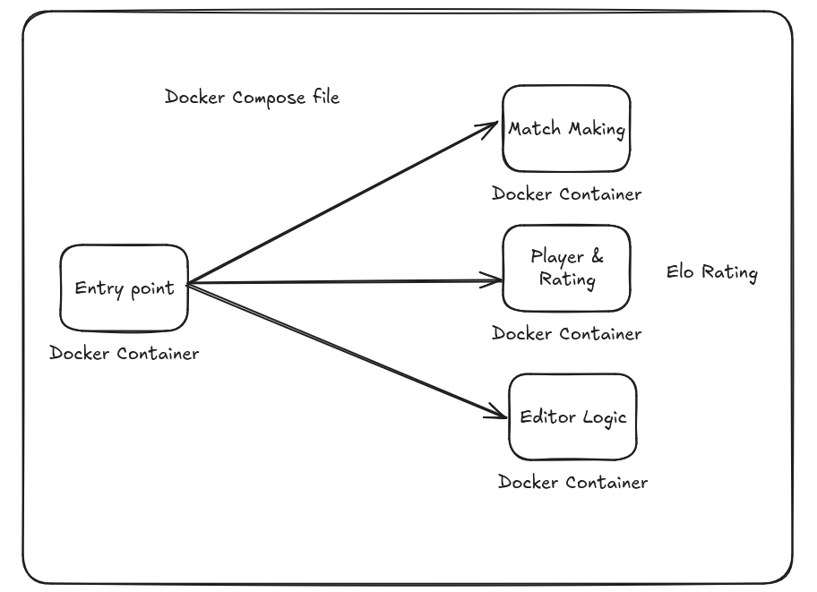

# **WCE: World Coding Entertainment**  
The Ultimate Showdown for Programmers! 💥

Welcome to **WCE**, where the stakes are higher than ever, and the competition is *FIERCE*—programmers from all over the world enter the **ring** to face off in coding battles, with glory, fame, and rankings on the line. But **beware**, in this arena, injuries are **REAL**, and the code? It's *unstoppable*!

---

## **Table of Contents** 📜  
1. [Introduction](#introduction)
2. [Technical Specifications](#technical-specifications)
3. [Frontend: The Ringmaster's View](#frontend-the-ringmasters-view)
4. [Backend: The Smackdown of Microservices](#backend-the-smackdown-of-microservices)
5. [Game Rules: How to Enter the Ring](#game-rules-how-to-enter-the-ring)
6. [How to Set Up the Project](#how-to-set-up-the-project)
7. [Contribute: Join the Squad](#contribute-join-the-squad)
8. [License](#license)

---

## **Introduction** 🏆  
In the world of **WCE**, *coding meets combat*, as top-tier programmers step into the ring, ready to throw down their best algorithms, solve puzzles, and face challenges. 

It’s a **battle royal** of wit, precision, and speed. Every line of code could be your victory… or your **downfall**.

> **WCE** is a competitive programming platform like no other, inspired by the high stakes and intensity of the pro-wrestling world. But in this arena, every coder is **the main event**—fighting to climb the ranks, earn their title, and out-code their opponents!

---

## **Technical Specifications** ⚙️  

The **WCE** is powered by cutting-edge technology, delivering an experience as smooth as a slam dunk and as powerful as a bodyslam. 

**Here’s how it’s built**:

| Component | Description |
| --------- | ----------- |
| **Frontend** | A sleek React app powered by Vite. A perfect setup for real-time updates, UI that *feels like the crowd's energy*, and fast responses that mirror a wrestling champ’s reflexes! |
| **Backend** | The real heavyweight champion here—built using Rust and microservices. Split into three services, each running in its own Docker container. |
| **Database** | SQL-based system to store player stats, rankings, and battle history. |
| **Cloud** | Hosted on [Your Cloud Provider Here], enabling easy scalability for tournaments and matches! |

---

## **Frontend: The Ringmaster’s View** 🎤

The frontend of **WCE** is like the **announce table** in every great wrestling event! It’s where you see the drama unfold—the match-ups, the wins, the rankings, and the code rolling through! It’s built using **React** and **Vite** for ultra-fast, interactive performance that will leave the crowd on their feet!

- **Fast as a Luchador:** Real-time updates of match scores, player rankings, and battle stats.
- **Easy to Navigate:** The front end is smooth, intuitive, and as dazzling as a championship belt.
- **Cross-Platform Glory:** Works perfectly on web browsers and mobile devices.

---

## **Backend: The Smackdown of Microservices** 💥  

We’ve split the backend into three **champion services**—each serving their own purpose to keep the match fair, exciting, and running smoothly:



1. **Player Service**: The backstage hero. Handles player ratings, sign-ups, logins, and more. Without this service, there’s no one to face off!
2. **Game Service**: The referee and matchbooker. Manages player matching, game logic, and ensures fair competition.
3. **Editor Service**: The final showdown. Handles remote code execution, test case evaluation, and makes sure each coder's performance is judged accurately.

Each of these services runs in its own **Docker container**. Together, they create the **ultimate match** for every coder ready to *enter the ring*!

---

## **Game Rules: How to Enter the Ring** 🥊

Think you have what it takes to be the **coding champ**? Here’s how it works:

1. **Sign Up**: Like stepping into the ring, get your player profile set up. You’re ready for the showdown.
2. **Matchmaking**: The **Game Service** takes care of matching you with a worthy opponent. Your skills, your chance.
3. **Code Battle**: Battle it out with coding challenges. **Fast** and **precise** are your best weapons!
4. **Victory or Defeat**: Only the strongest algorithms survive. Win or lose, you’ve just earned your place in the **WCE world**!

---

## **How to Set Up the Project** ⚒️

Want to take on the WCE ring for yourself? Here's how you can get the project running on your local machine.

### **Prerequisites**:
- Install [Rust](https://www.rust-lang.org/)
- Install [Docker](https://www.docker.com/)
- Install [Node.js](https://nodejs.org/)

### **Steps**:
1. **Clone the repository**:
    ```bash
    git clone https://github.com/your-repo/wce.git
    cd wce
    ```
2. **Set up backend services**:
    Run the following command to start the backend services in Docker:
    ```bash
    docker-compose up
    ```

3. **Start the frontend**:
    In a separate terminal, navigate to the frontend directory and run:
    ```bash
    npm install
    npm run dev
    ```

4. **Now you're in the ring!** Your app should be running on `localhost:3000`.

---

## **Contribute: Join the Squad** 🏅  

We’re always looking for *new contenders* to join the **WCE** squad. If you have ideas for new features, improvements, or just want to add your personal touch to the arena, **step into the ring**!

### **How to contribute**:
- Fork the repo.
- Create a new branch.
- Add your feature or fix a bug.
- Submit a pull request. We'll make sure to **appreciate your contribution** with the highest respect!

---

## **License** 📜  

The **WCE** project is open-source and licensed under the [MIT License](LICENSE). Everyone's invited to join the **world of coding entertainment**.

---

*Let the coding battle begin!* 💥👨‍💻👩‍💻
